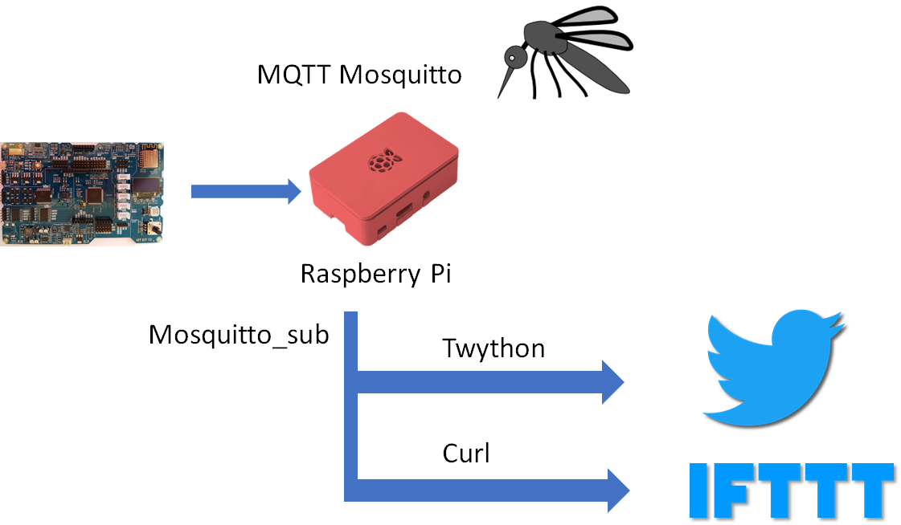
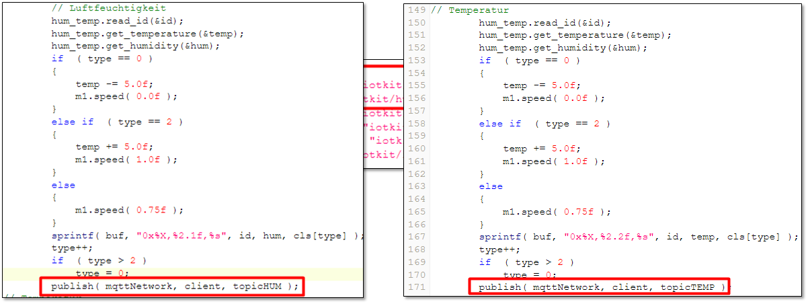
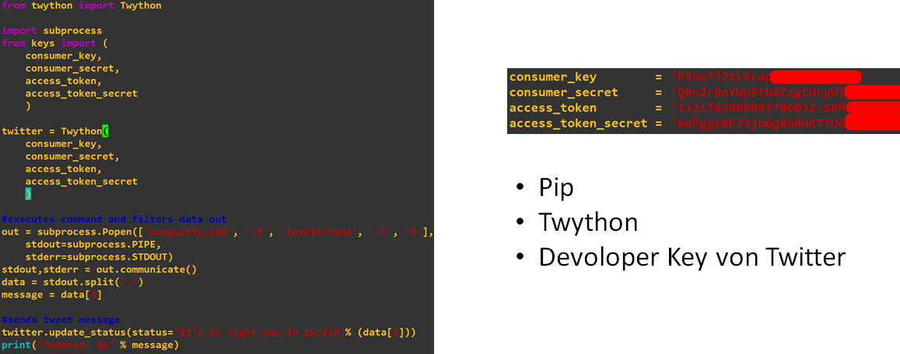
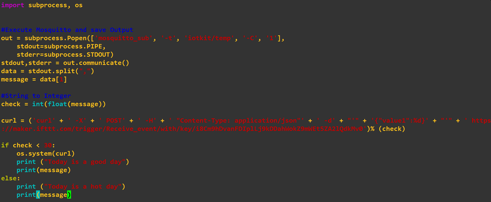
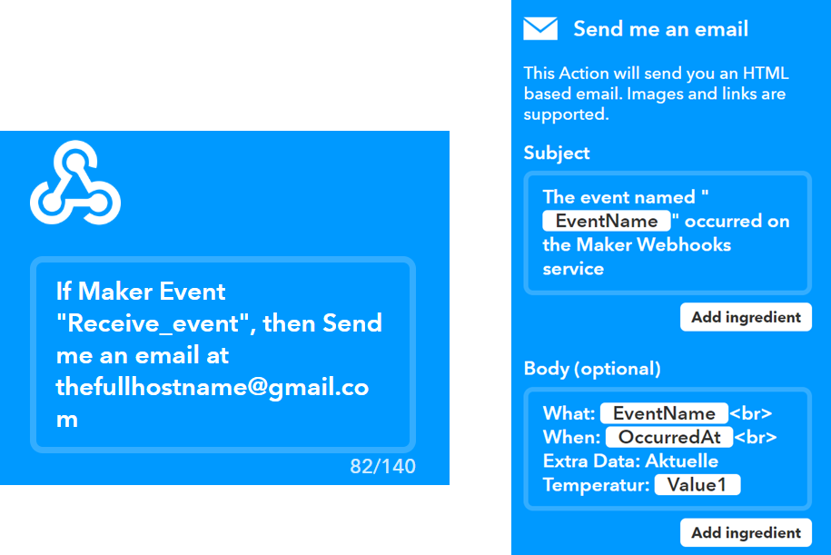

LB3-MQTT-Python-Twitter
=======================

Die nachfolgende Dokumentation basiert auf einer Projektarbeit, für das Modul 242, an der Technischen Berufsschule Zürich, von Kabashi Aris, Funhoff Thomas und Frunz Kevin.

Idee und Ziele
--------------

- - -

Anpassungen mbed
----------------

- - -

MQTT - Twitter Bridge (Python)
------------------------------

- - -

IFTTT
-----

MQTT - IFTTT Bridge
- - -

Konfiguration IFTTT
- - -

Umsetzung
---------

Raspberry Pi als MQTT Broker und Gateway zu IFTT aufsetzen:
* [Mosquitto](https://mosquitto.org/) und Python installieren
* `sendmail.py` und `sendtweet.py` anpassen und starten
    
IoTKit als MQTT Publisher aufsetzen:
* [MQTTPublish](https://os.mbed.com/teams/IoTKitV3/code/MQTTPublish/) in Online Compiler importierten
* Variable `hostname` und `port` auf Raspberry Pi anpassen.  
    

